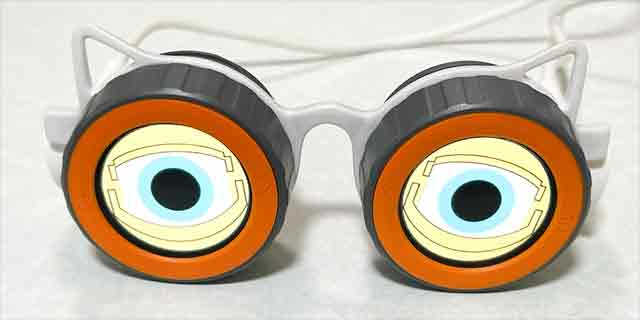

# M5Dialクレイジーアイズ



紐をあごにひっかけてしゃべるとまばたきをするメガネ型のおもちゃ（株式会社アガツマのクレイジーアイズ）をM5Stack社のM5Dialをぜいたくに2個も使ってデジタルにしてみました。

詳細は「[M5Dialクレイジーアイズ](https://protopedia.net/prototype/4810)」（ProtoPedia）をご覧ください。

## ファームウェアのコンパイル・アップロード

[PlatformIO IDE](https://platformio.org/platformio-ide)環境でファームウェアのコンパイル・アップロードをします。
M5Dialにファームウェアを書き込むときは，StampS3の真ん中にあるダウンロードモードボタンを押しながら，M5Dialのリセットボタンを押してダウンロードモードにする必要があるので注意してください。

運用上の手間を省くため，それぞれのM5Dialを右目用・左目用と固定する方法と，起動後に右目の向き・左目の向きに切り替えることで動的に設定する方法の2通りの実行方法を用意しています。

### 右目・左目を固定する場合

1. M5Dial 2個をそれぞれ右目用・左目用と決めておきます。
2. M5DialをそれぞれPCと接続し，ダウンロードモードにしてどのポートに接続されているか確認します。
3. `platformio.ini`の`env:crazy-eyes-right`，`env:crazy-eyes-left`のupload_portのコメントを外し，2で確認したポートに書き換えます。
4. 画面下にあるステータスバーに表示されている環境を`Default(m5dial-crazy-eyes)`に切り替えます。
5. 画面下にあるステータスバーに表示されているポートが`Auto`に切り替えます。
6. アップロードボタン（「→」アイコン）を押します。

### 右目・左目を固定しない場合

1. M5Dialのどちらか1台を選択します。
2. 選択したM5DialをPCに接続し，ダウンロードモードにしてどのポートに鉄鏃されているか確認します。
3. 画面下にあるステータスバーに表示されている環境を`env:crazy-eyes(m5dial-crasy-eyes)`に切り替えます。
4. 画面下にあるステータスバーに表示されているポートを確認したポートに変更します。
5. 画面下にあるステータスバーに表示されているアップロードボタン（「→」アイコン）を押します。
6. もう1台のM5Dialについても 2. から 5. までを実行します。

## 使い方

起動すると以下のようにバージョン番号，設定，動作モードを表示します。

```
Crazy Eyes v0.0.2
Config:
 AutoMode: false
 Interval: 100ms
Mode:
 Manual or Auto
Orientation:
 Manual, Right Eye, or Left Eye
```

その後，目の画像が表示されます。M5Dialのダイヤルを回すたびに，目を閉じたり開いたりを繰り返してまばたきします。

ファームウェアのコンパイル・アップロードで左目・右目を固定した場合としなかった場合で，起動後にAボタンを押したときの挙動が異なります。

* 固定した場合は，Aボタンを押すたびに自動モードのオン・オフを切り替えます。
* 固定しなかった場合は，Aボタンを押すたびに右目の向き・左目の向きに切り替わります。
